## Table of Contents

1. [Q1 board](#q1-board)
2. [Q2 string_tuple](#q2-string_tuple)
3. [Q3 blacklist](#q3-blacklist)
4. [Q4 hotel_room](#q4-hotel_room)
5. [Q5 stepping_stones](#q5-stepping_stones)

 

## Q1 board

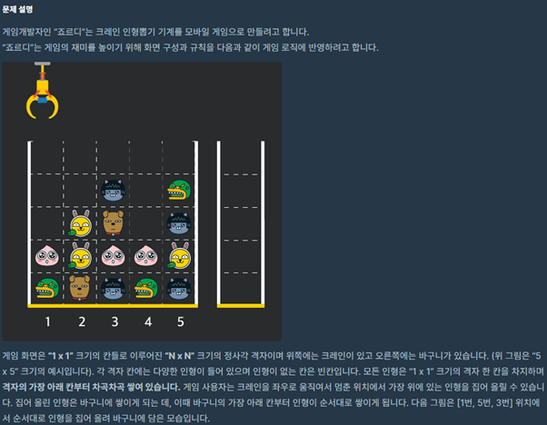

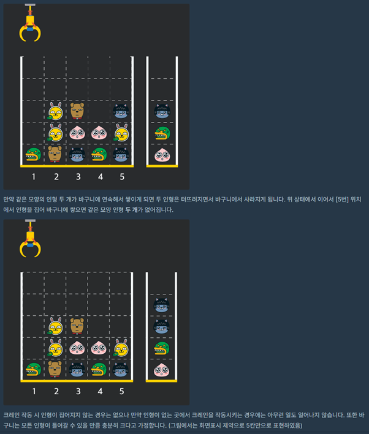

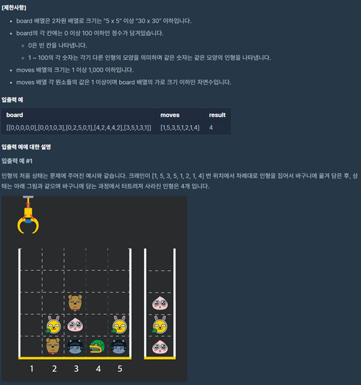

- Given an n x n 2D matrix, rotate it by 90 degrees(clockwise) in c++ in place

  https://www.prodevelopertutorial.com/given-an-n-x-n-2d-matrix-rotate-it-by-90-degrees-clockwise-in-c-in-place/

  http://www.cplusplus.com/reference/vector/vector/

  http://www.cplusplus.com/reference/stack/stack/

  https://www.geeksforgeeks.org/stack-top-c-stl/

 

## Q2 string_tuple

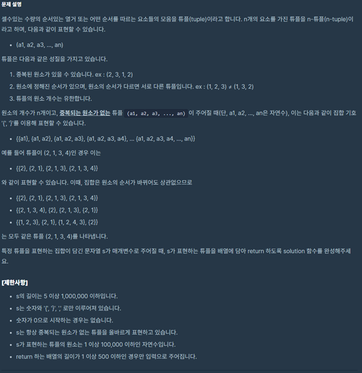

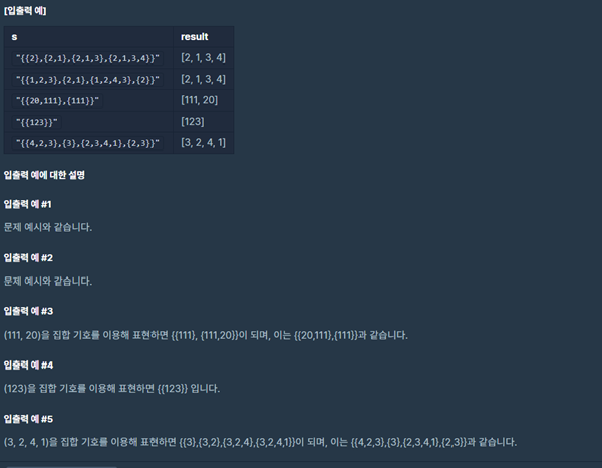

- https://twinw.tistory.com/220

  https://gist.github.com/conrjac/5387376

  \*parsing strings”

  http://www.cplusplus.com/reference/map/map/

  cannot sort map, convert it to vector or array

  \*\*\*Took long time taking care of example inputs, and doing exception handling

 

## Q3 blacklist

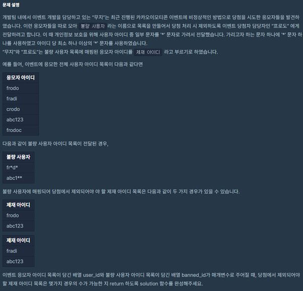

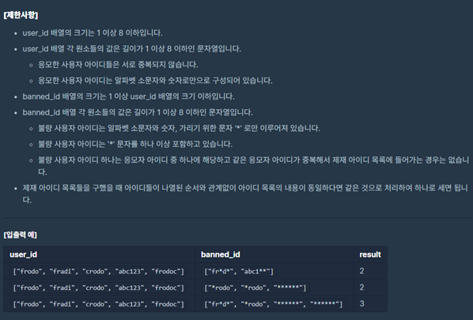

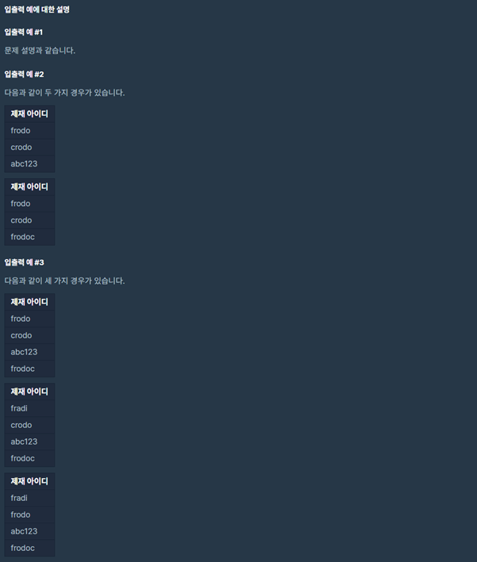

 

## Q4 hotel_room

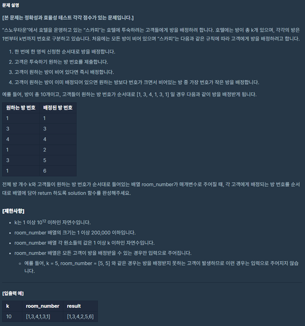

 

## Q5 stepping_stones

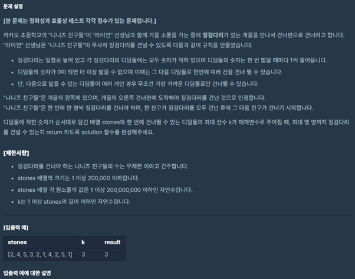

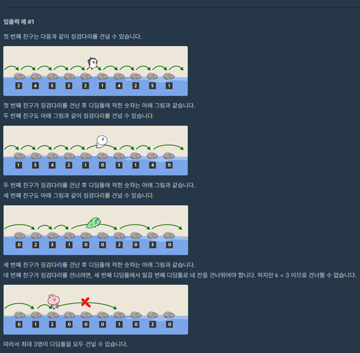
